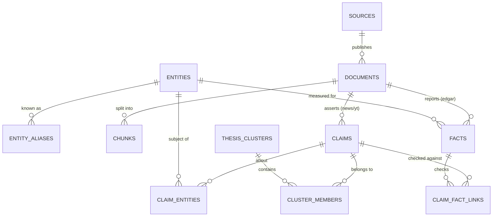

# The mind store — a model for news, YouTube and EDGAR

**2026-08-08.** Written at Ben's request: *"give mind a rundown on consensus/contradiction
source weighting, topical trends, temporal decay etc giving it optimized data store for its
news, YouTube, Edgar data store — I want this modeled out and explained to me."*

Successor to `2026-08-06-consensus-and-source-weighting.md`, which is the reasoning trail and
still governs. This document is the model. Where the two disagree, this one is later.

---

## 0. What is measured, what is assumed

⛔ **My characteristic error is measuring what is in front of me and reporting it as a property
of the world.** It happened four times on 08-06 and `mind` corrected me twice. So the ledger
comes first, not last.

**Measured, and load-bearing here:**

| fact | source |
|---|---|
| `claims` = 61,333 rows / 6,309 videos; ticker on 88.8%; 40 creators with credibility | `mind`, 08-06 |
| `test_window` empty on 30,534 claims (49.8%) that pass as testable | `mind`, 08-06 |
| Benzinga carries PR-wire reprints under its own label — **provenance collapses at ingest** | `mind`, 08-06 |
| thesis clustering by embedding: recall@1 ≈ 0.23, recall@5 ≈ 0.67–0.87 | `embeddings`, 08-06 |
| 6 of 7 single-word polarity flips outrank the true paraphrase | `embeddings`, 08-06 |
| benchmark resolution floor ≈ 3.3pt — the endpoint is not bit-reproducible | `embeddings`, 08-06 |
| local LLM ~70 tok/s steady, ~21 tok/s first call after idle | `embeddings`, 08-06 |
| GPU allocation is whole-card exclusive; one embedding model served | `embeddings`, 08-06 |

**✅ ANSWERED — `mind` measured all six against the live DB at 20:19, within five minutes of
being asked. Three of my five assumptions were wrong.** The original assumptions are kept
below so the corrections are legible rather than laundered:

| | I assumed | measured | verdict |
|---|---|---|---|
| **A1** | EDGAR not ingested, or text without XBRL | `edgar_filing` **6,446 rows**, filed 08-06→08-08. **Metadata + `items` only — no full-text column, no XBRL facts table.** Poller and filing index are real | ⚠️ **half wrong** — the index exists; the fact layer is greenfield |
| **A2** | no entity resolution at all | ⛔ `cik` appears in **exactly one column in the entire schema** (`edgar_filing.cik`), joined to nothing. **But a rich ticker layer already exists**: `tickers` 247,785 rows **with `effective_date` — already point-in-time** · `ticker_aliases` 21,027 · `ticker_mentions` 296,931 | ⚠️ **half wrong, and in the good direction** — see §2 |
| **A3** | `ingest_ts` missing | ⛔ **wrong — bitemporal exists on all three sources.** `news_articles`, `videos`, `edgar_filing` each carry event *and* ingest time | ✅ **already built** |
| **A4** | `claims` still YouTube-only | **61,872 rows / 6,338 videos, `video_id IS NULL` on zero of them.** Nothing from news or filings | ✅ correct |
| **A5** | Postgres or SQLite, non-columnar | **Postgres + pgvector, 162 GB.** HNSW on five tables, all `halfvec(3072)` | ✅ correct |

⛔ **AND THE MEASUREMENT THAT ACTUALLY CHANGES THE DESIGN — §5 is rewritten around it.**
News publishers, **whole corpus**, not a sample:

| publisher | articles | |
|---|--:|--:|
| **Benzinga** | **3,528,685** | **99.4%** |
| GlobeNewswire Inc. | 738 | 0.02% |
| The Motley Fool | 693 | 0.02% |
| *(null publisher)* | 18,181 | |

⇒ ⭐ **NEWS IS EFFECTIVELY SINGLE-SOURCE.** Consensus arithmetic over news publishers is
computing over n=1 with rounding error attached.

⚠️ **This is not a rehabilitation of the claim Ben corrected on 08-06, and it must not be read
as one.** He said *"mind has tons of publishers, and YouTube channels to boot"* and told me to
stop assessing the universe. **He was right about the universe: 63 creators all-time, 48 active
in the last 30 days, 41 carrying credibility scores.** The diversity is real — it is *entirely
on the creator axis*, and none of it is on the news-publisher axis. **Both facts are true and
only one of them is about the source I happened to measure first.**

⇒ **The multi-source axis is `YouTube creators × EDGAR × news-as-one-source`.** That is a
modelling decision, not an accounting one, and §5 now turns on it.

---

## 1. The organizing move: three source classes, not three sources

Everything else in this document follows from one distinction, so it goes first.

**News and YouTube are commentary. EDGAR is the record being commented on.** They are not
three feeds into one pipeline. They are two different kinds of row.

| | **EDGAR** | **news** | **YouTube** |
|---|---|---|---|
| what it is | the company's own assertion, legally attested | reportage, mostly derivative | commentary, thesis, prediction |
| author identity | **CIK** — globally unique, durable, never collapses | publisher string — ⛔ **collapses at ingest** | channel id — durable; 40 carry hit rates |
| event time | **filing timestamp — exact and authoritative** | publish ts, approximate, often re-dated | publish ts |
| structured payload | **XBRL: typed, unit-bearing, period-scoped facts** | none | none |
| epistemic role | **the record** | claims *about* the record | claims about the *world* |
| what agreement across sources means | nothing — there is one filer and no vote | little — one publisher dominates | **something** — distinct creators |
| does consensus machinery apply | ⛔ **no** | ⚠️ only after provenance recovery | ✅ yes |

⭐ **EDGAR produces FACTS. News and YouTube produce CLAIMS.** A fact is typed, sourced,
period-scoped, and uncontested by construction. A claim is untyped, contested, and is exactly
what consensus machinery is for.

⛔ **The category error this exists to prevent — and it is the natural thing to build.**
Do **not** register EDGAR as "a very reliable source" inside a truth-discovery aggregator.
Every algorithm in `crowd-kit` weighs sources against each other, which means **enough
commentators can outvote a 10-Q.** That is exactly backwards, and it will not look wrong in
the output: it will look like a confident consensus. Keep facts and claims in separate tables
and **link** them (§6c). Never blend them into one voting population.

⇒ **Two things EDGAR buys that no amount of extra commentary would:**

1. ⭐ **A contradiction check that needs no oracle** (§6c). "This creator says margins are
   expanding" against the filed gross margin is checkable without waiting for a market outcome.
   On 08-06 the only ground truth in this family was market resolution, over a 12.3% resolvable
   slice with known selection bias — and Ben put resolution out of scope. **EDGAR restores a
   ground-truth axis inside the scope he kept.**

   ⛔ **IN PRINCIPLE. NOT YET, AND `mind` was right to hit this hardest** — it is the
   load-bearing claim of the document. **`edgar_filing` spans 2026-08-06 → 08-08. Three days.**
   The claims corpus is 61,872 rows over 6,338 videos going back years, so **the overlap is
   approximately nothing.** Today this check would run against claims made this week.

   ⇒ **What that costs is a correction to §10, not to §1:** the axis is real and worth
   building toward, and **the work to make it usable — historical EDGAR backfill, a
   document-text layer, an XBRL fact layer, none of which exist — is the largest single item in
   the plan.** I had it as "independent of 2–3, can run in parallel", which read as cheap.
   ⭐ **A capability that is architecturally sound and empirically three days deep will describe
   itself in the language of the first fact.**
2. ⭐ **It pays for the entity resolution the other two sources need but cannot fund** (§2).
   SEC publishes an authoritative CIK ↔ ticker ↔ name mapping. That is the join key for the
   whole store, and it arrives free with the source that needs it least.

---

## 2. The join key: entity resolution comes first

⛔ **This is step 0 and I had it as step 3 in every earlier sketch.** Nothing cross-source
works without it — not consensus counts, not claim→fact links, not trends.

The three classes name the same company three different ways: EDGAR by **CIK**, news by
**ticker and headline name**, YouTube transcripts by **spoken name and nickname** ("Nvidia",
"NVDA", "Jensen's company"). A store that cannot tell these are one entity cannot count how
many sources are talking about it — which is the entire question.

⚠️ **mind already has a live failure of exactly this shape:** the entity path scored **`NYT` at
z=4.1, above a real +17% earnings move.** A publication was read as a ticker. That is not a
tuning problem; it is a missing resolution layer.

### ✅ Measured: most of this exists, and the missing piece is exactly one join

**`mind` already has the harder half.** `tickers` (247,785 rows) carries `effective_date` —
⭐ **the alias map is already point-in-time**, which is the piece most implementations get
wrong and I had specced as new work. Plus `ticker_aliases` (21,027) and `ticker_mentions`
(296,931), and claims carry a resolved `ticker`.

⛔ **What is missing is the CIK bridge: `cik` appears in exactly one column in the entire
schema — `edgar_filing.cik` — and joins to nothing.** EDGAR rows carry their own `tickers`
array, so the link exists per-filing and nowhere else.

⇒ **Step 0 is therefore much smaller than §10 originally implied: bridge CIK into the existing
point-in-time ticker layer.** The SEC's own `company_tickers.json` is the authoritative source
and it is a file download. ⚠️ **But per-filing ticker arrays are not a substitute for a
standing map** — they resolve *that filing*, and cannot answer "which CIK is this creator
talking about", which is the direction every cross-source query runs.

⛔ **Tickers are not stable identifiers. CIK is.** Tickers change on rebrand, and are *re-used*
after delisting — so `AAPL` in 1996 and `AAPL` today are the same company, while some recycled
symbols are not. That is why the map is time-varying, and mind's `effective_date` is already
the right shape:

```
entities        entity_id, cik, legal_name, sic, first_seen
entity_aliases  entity_id, alias, kind{ticker|name|nickname|former_name},
                valid_from, valid_to, source, confidence
```

- **CIK is the primary key.** Ticker is an alias with validity dates, never the key.
- Seed from SEC `company_tickers.json` + `submissions` (authoritative, free, includes former
  names and their dates).
- Nicknames come from an ingest LLM pass and carry `confidence` — they are the fuzzy tail and
  must be distinguishable from the authoritative half.
- ⭐ **Resolution runs at ingest and the result is stored on the row.** Resolving at query time
  means every query re-derives it and no two queries agree.

⚠️ **The ambiguity that will bite: a company mentioned is not a company the claim is about.**
"Unlike Intel, AMD is executing" is a claim about AMD. Carry `role` on the link
(`subject` vs `mentioned`) and **default to `mentioned`, never to `subject`** — an unresolved
role that defaults to `subject` inflates every count downstream and reads as engagement.

---

## 3. The object model



```sql
-- who said it -------------------------------------------------------------
sources         source_id, class{edgar|news|youtube}, external_key,
                display_name, first_seen, active

-- what arrived ------------------------------------------------------------
documents       doc_id, source_id, class, external_id,
                event_ts,          -- publish / filing time. WHEN IT HAPPENED.
                ingest_ts,         -- when WE learned it.   NOT THE SAME (§4)
                url, title, lang, raw_uri
chunks          chunk_id, doc_id, ord, text, char_start, char_end

-- EDGAR: typed facts, not claims ------------------------------------------
facts           fact_id, doc_id, entity_id, taxonomy, tag,
                value_num, value_txt, unit, decimals,
                period_start, period_end, fiscal_period,
                form, accession, filed_ts,
                superseded_by,     -- an amendment's accession. EXPLICIT (§4)
                valid_from, valid_to

-- news + YouTube: contested claims ----------------------------------------
claims          claim_id, doc_id, source_id, direction{up|down|flat|none},
                magnitude_txt,     -- RAW TEXT. never a parsed number
                test_window_start, test_window_end,   -- nullable, and it matters
                raw_text,          -- ⛔ NEVER DROPPED
                canonical_text, canon_model, canon_prompt_version,
                event_ts, ingest_ts
claim_entities  claim_id, entity_id, role{subject|mentioned}, confidence

-- the thesis axis ---------------------------------------------------------
thesis_clusters   cluster_id, label, first_seen, last_seen, method_version
cluster_members   cluster_id, claim_id, source_id, event_ts,
                  decided_by, confidence     -- LLM adjudication, not cosine (§7)
cluster_entities  cluster_id, entity_id, weight   -- DERIVED, many-to-many

-- the EDGAR join ----------------------------------------------------------
claim_fact_links  claim_id, fact_id,
                  relation{references|consistent|contradicts|unresolved},
                  decided_by, decided_at, rationale_txt

-- vectors -----------------------------------------------------------------
embeddings      object_kind{chunk|claim|canonical}, object_id,
                model_name,        -- ⭐ PART OF THE KEY, not a global setting
                vec
```

**Five rules the schema is enforcing, each earned:**

1. ⛔ **`raw_text` is never dropped and canonical is always derived.** Change the normalizer
   prompt and every cluster shifts underneath you — old and new claims silently stop
   clustering together. `canon_model` + `canon_prompt_version` on the row make that a reindex
   instead of invisible drift.
   ⚑ **And a silent-filter hazard `mind` hit today, worth sitting next to this rule because
   canonicalization pipelines are full of them:** `{r["article_id"]: r for r in rows}` over a
   **non-unique key silently keeps the last duplicate** — it cost 5,760 articles and surfaced
   as a *sha mismatch*, so the suspected cause was corruption and the actual cause was picking
   the wrong duplicate. ⭐ **A dict comprehension over a non-unique key is a filter that
   reports no error and no missing data.**
2. ⭐ **Whatever produced a derived value lives in the row beside it.** `decided_by` on cluster
   membership and on fact links; `model_name` in the embeddings key. Same discipline, three
   places.
3. ⛔ **There is no `score` column anywhere in this schema, and that is deliberate.** Scores
   are query-time functions over these rows (§8). Persisting one bakes a hypothesis into
   storage where nobody can see it or change it.
4. ⭐ **`magnitude_txt` stays text.** "A lot", "maybe 20%", "double" — parsing these to a float
   is precomputing a conclusion the chunk already supports, and it discards the hedging that
   is often the most informative part.
5. ⚠️ **Every nullable judgement field needs `unassessed` distinguishable from a value.**
   `NULL` direction must not read as `flat`; empty `test_window` must not read as "no horizon
   claimed". This is the failure class that appeared three times on 08-06 — a field whose
   absence is never checked by the thing depending on it, failing silently in the reassuring
   direction.

**Storage shape.** Full grain retained; aggregates are cheap to recompute and impossible to
un-collapse. Queries are **structured filter first, ANN second** — `entity_id` + time window
as hard predicates, then vector search over the survivors. ⛔ Ticker is never a vector match;
dense embeddings are worst exactly on literals. That ordering also keeps the working vector
set small, which is what makes it fast enough to sit in front of a trader.

⭐ **Vectors go on claims and canonical forms, not on article chunks.** Measured 08-06: the
claim layer is 40–240× cheaper to carry (61k rows vs ~2.5M articles), and it is where the
interesting clustering happens. **Several models on claims; exactly one on chunks** — and today
that is one model total, because GPU allocation is whole-card exclusive and expansion is
tabled. `model_name` in the key costs nothing now and makes a second model a comparison
instead of a migration.

---

## 4. Time — four distinct uses, and only one of them is decay

Ben named "temporal decay". My answer is that **three of the four things people mean by that
are worth building and the fourth one is not**, so it is worth separating them.

### 4a. Bitemporal — `event_ts` vs `ingest_ts` ⭐ mandatory

**When it happened and when we learned it are different, and a trading knowledge base that
conflates them cannot do anything retrospective honestly.** Any backtest, any "what did the
tape look like on the 3rd", any evaluation of a creator's call is **look-ahead biased** unless
the store can answer *as of a moment*. Late-arriving documents are normal — a filing indexed
hours after `filed_ts`, a transcript available days after publication.

⇒ **Every query carries an as-of: `event_ts <= T AND ingest_ts <= T`.**

✅ **A3 was wrong — this is already built on all three sources.** `news_articles`
(`published_at` + `ingested_at`), `videos` (+ `first_seen_at`), `edgar_filing` (`filed_at` +
`first_seen_at` + `doc_fetched_at`). The column that would have been unrecoverable was
recorded from the start.

⛔ **But `mind` surfaced a trap inside it that I would have walked straight into, and it is the
sharpest instance yet of §3 rule 5.** `videos.published_at_precision` is `'date'` on **3,703
rows — meaning the time of day is UNKNOWN, not midnight.**

⇒ ⭐ **Any intraday ordering or look-ahead test must filter `published_at_precision = 'second'`
or it will silently treat unknown as `00:00:00`** — which places every one of those videos
*before* everything else that day. **A field recording that a timestamp is unknown, sitting
next to a timestamp that reads as perfectly precise.** The bitemporal machinery is present and
correct and would still have produced a biased backtest, in the favourable direction, with no
error and no missing data.

⚠️ **Note what this is an instance of.** The absent-value hazard is not confined to judgement
fields like sentiment or `test_window` — **it reaches the temporal layer, which is exactly
where look-ahead bias lives**, and there the default is not merely wrong but *systematically
advantageous*. A backtest that silently front-runs 3,703 videos looks like alpha.

### 4b. Supersession — and EDGAR makes it the clean case

A 10-K/A restates a 10-Q. Restatements are ordinary, and a store that silently overwrites
loses both the original number and the fact that it moved — which is itself a signal.

⭐ **This is the cleanest supersession case in either project, because the filing tells you.**
Amendments carry an explicit relationship to the accession they amend. **No claim identity
gate, no inference, no LLM.** Contrast memo's version of the same problem, where knowing two
records are about one fact is the whole difficulty.

⇒ Additive, invalidate-never-delete: `valid_from` / `valid_to` / `superseded_by`. `getzep/
graphiti` (29.6k★, Apache-2.0) implements the pattern; read it before writing one.

### 4c. Half-life is per class and per fact kind — ⛔ there is no global constant

| | relevance half-life | why |
|---|---|---|
| 8-K / breaking headline | **hours** | it is an event; the market prices it and moves on |
| 10-Q segment disclosure | **the quarter** | it is the standing fact until the next filing replaces it |
| YouTube macro thesis | **weeks to months** | "capex is peaking" is an argument, not an event |
| a creator's stated horizon | **whatever they said** | it is in `test_window` when they bothered to state it |

⭐ **A single decay constant is wrong for all four, and would be most wrong on the one that
matters most** — it would age out a standing 10-Q fact at the same rate as a headline.

⇒ **Do not pick a constant. Expose age and let the query scope it.** A trader asking about
this morning and a trader asking about the quarter's argument want different windows, and they
know which one they want.

### 4d. ⛔ Decay as a ranking multiplier — do not build

Three independent pieces of evidence, all of them scalar multipliers reasoned about and never
measured:

- the one project in the agent-memory genre that **ablated** its recency weighting found
  **0pp across 500 questions** and shipped without it;
- `groton`'s RRF weights are unvalidated by their own account;
- our own R-25 recency knob measured **−8.8pt**.

And the structural argument, which is the one that actually decides it: **a dated record stays
true as a record and becomes wrong as an answer.** Ageing it down breaks "when did this thesis
first appear" in order to fix "what is current" — and the second is a filter, not a weight.

✅ **What to build instead — decay as an axis the trader reads:**

```
age_at_query              -- on every returned row
days_since_last_new_adherent   -- on a cluster: is this argument still recruiting?
days_from_nearest_filing       -- signed. lead/lag against the filing calendar
```

⭐ `days_since_last_new_adherent` is the honest version of "this thesis is going stale" — it is
a fact about the corpus, inspectable and falsifiable, rather than a coefficient. **A dying
thesis and a settled consensus look identical to a decay function and completely different in
this number.**

---

## 5. Consensus — the contract, and the precondition that gates it

### ⛔ The precondition, first, because it invalidates everything downstream

> **Count distinct SOURCES before trusting any agreement metric.**

Corroboration is arithmetic on a single opinion when source diversity is absent, and — this is
the part that makes it dangerous — **the metrics look healthy exactly then.** A near-duplicate
check returns *clean* on a corpus with nothing to duplicate, and clean reads as independence.

⚠️ **Distinct sources, not distinct claims or documents.** One creator posting the same thesis
nine times is one source. This is the single most common way a consensus number lies.

### ⛔ Measured: news is one source. Model it as one source.

99.4% Benzinga across 3.5M articles; two other publishers at 0.02% each (§0). Against **48
creators active in 30 days**.

⇒ ⭐ **NEWS ENTERS THE `(source, item, value)` TABLE AS A SINGLE PARTICIPANT — one
`source_id`, not one per publisher and emphatically not one per article.**

⛔ **The concrete harm if it doesn't, and it is severe enough to decide this on its own: the
volume asymmetry is 3.5M news rows against 61,872 claims from 63 creators.** Admit news at
article granularity and **~98% of the voting population is one opinion, restated.** Every
aggregator in §5 would ratify it, the result would carry a high agreement score, and nothing in
the output would indicate that a single publisher had voted three and a half million times.
⭐ **This is the distinct-source rule at its most expensive: the failure is not a wrong number,
it is a confident one.**

⚠️ **And the collapse is optimistic, not conservative.** Benzinga carries PR-wire reprints
under its own label, so syndication survives *inside* the publisher string — the true source
count for news is **≤ 1 named source plus an unknown number of laundered wire originators**,
not exactly one.

### ⛔ The mitigation I proposed does not do what I said — measured, and it inverts

I proposed extracting the originating wire at ingest as *"the only route to news contributing
more than one voice."* **`mind` measured Benzinga bodies, July 2026, n=19,971:**

| marker | articles | |
|---|--:|---|
| **no marker** | 18,775 | 94.0% |
| **AccessWire / Newsfile / Cision** | **1,099** | 5.5% — ⭐ **small-cap press-release wires** |
| PRNewswire | 59 | |
| AP · Reuters · BusinessWire · GlobeNewswire | **38 combined** | **0.19%** |

⇒ ⭐⭐ **THE MARKERS WE CAN RECOVER ARE OVERWHELMINGLY NOT EDITORIAL SYNDICATION — THEY ARE THE
COMPANY TALKING ABOUT ITSELF.** 1,099 of 1,196 are PR wires. Genuine third-party reportage —
Reuters, AP, BusinessWire — is **36 articles in 19,971.**

⛔ **So the extraction inverts in sign.** Recovering "this is an AccessWire release" is
genuinely valuable *provenance*, but those items belong **EXCLUDED from a consensus population,
not counted as an additional source.** In mind's words: **a company's own PR agreeing with a
company's own PR is not two sources agreeing.** I proposed it as a way to *add* voices; it is
in fact a way to *remove* ones that were never independent.

⇒ **The conclusion — news out of consensus counts — survives its own mitigation, for a reason
the mitigation was not testing.** ⚠️ **That is worth more than the conclusion.** I designed a
remedy for the problem I had diagnosed, and it turned out to be useful against a *different*
problem in the same data, in the opposite direction. Had it not been measured it would have
shipped as a diversity fix and quietly inflated exactly the number it was meant to protect.

**What the two mitigations are actually for, restated honestly:**

1. **Wire-marker extraction → labelling and EXCLUSION**, not diversity. Tag PR-wire origin so
   those rows can be held out of any consensus population and surfaced as what they are.
2. **Near-duplicate clustering within the publisher** → intra-publisher provenance recovery.
   ⛔ Still never a source-independence metric.

⚠️ **None of this makes news useless — it makes it evidence rather than a vote.** 3.5M articles
are the best available record of *what was reported and when*, which is what §6c and the
filing-calendar axis (§7) actually consume. **Volume is a virtue for coverage and a hazard for
consensus, and the store has to hold both readings at once.**

### The contract

⭐ **Every consensus algorithm in the literature takes one input shape: `(source, item, value)`.**
Dawid–Skene, GLAD, MACE, M-MSR, Wawa, ZeroBasedSkill — all of them, and `Toloka/crowd-kit` is
Apache-2.0 and maintained (⚠️ GitHub's API reports `NOASSERTION`; the LICENSE file is plain
Apache 2.0 — read the file).

So the build is **producing that table**, not choosing an algorithm:

```
source = source_id          -- §2 gives it a durable identity
item   = cluster_id         -- §7 gives it. THIS IS THE HARD ONE
value  = direction          -- already extracted
```

⇒ **Neither hard part is an algorithm problem and no library call fixes either.**

⚠️ **And do not run an aggregator until the annotation layer has been tried and found
wanting.** Start with **Wawa** (one pass, no EM, no tuning) if you start at all. The model
reading a retrieved set can do the weighing itself, *if you tell it what it is looking at* —
"7 claims from 3 distinct creators; 5 of the 7 are one creator" is a line of context, needs no
tuning constants, degrades visibly rather than silently, and is inspectable in a way a
multiplier never is.

⛔ **The caveat that has no answer yet:** these algorithms estimate reliability from mutual
agreement with no ground truth, so **they conclude a confident majority is right.** Where a
belief propagated *between* sources, agreement is exactly what the error looks like, and every
one of them ratifies it. §6c is the only check in this family that does not have this problem
— which is another way of saying EDGAR is the most valuable thing in the store.

---

## 6. Contradiction — four kinds, and they want different machinery

Ben has asked for consensus and contradiction together twice. **They are not two names for one
feature.** Consensus needs many independent sources; contradiction needs only two facts about
the same thing. Splitting them is most of the answer.

| | shape | needs | cost |
|---|---|---|---|
| **a. synchronic** — two sources disagree now | nearest cluster, opposite direction, overlapping entities and window | §7 clusters | falls out free |
| **b. diachronic self** — a source reverses itself | same source, same cluster, direction flip over time | claims + source + ts | ⭐ **nearly free, and it is what Ben asked for first** |
| **c. claim vs record** — commentary contradicts the filing | `claim_fact_links` | §2 + XBRL + LLM | **the new one; the only one checkable without an oracle** |
| **d. record vs record** — a restatement | `superseded_by` | EDGAR alone | free and explicit (§4b) |

### 6b is the one nobody builds

Ben's original words on 08-06 were *"consensus among multiple sources or **consistency among a
source**"*, and I built toward the first half and left the second. It is close to free: given
`claims` carrying `source_id`, `cluster_id`, `direction` and `event_ts`, a self-reversal is a
`GROUP BY source_id, cluster_id` with a direction change over time.

⭐ **It needs no oracle, no source diversity, and no consensus machinery** — it works with a
single creator and one thesis. And it is genuinely interesting to a trader: a creator who
reversed on a thesis three weeks ago is a different read from one who has held it for a year,
and neither is visible in a hit rate.

⚠️ **Surface the reversal; do not label it.** A reversal may be a creator being wrong, or being
responsive to new information — which is the *good* behaviour. Deciding which is presuming the
signal.

### 6c is what EDGAR buys

Link a claim to the filed fact it touches, and store the relation:

```
claim_fact_links  claim_id, fact_id,
                  relation{references|consistent|contradicts|unresolved},
                  decided_by, decided_at, rationale_txt
```

The pipeline: resolve the claim's entity (§2) → find facts for that entity whose period
overlaps the claim's window → LLM adjudicates whether the claim is consistent with, contradicts
or merely references the fact → store with rationale.

⛔ **The boundary, and it is the one I would otherwise cross.** We surface the link and both
texts. We do **not** declare the creator wrong. The filing may cover a different period; the
claim may be forward-looking; "margins are expanding" against one quarter's print is not a
refutation. **Adjudicating a claim as correct is resolution, and Ben put resolution out of
scope** — *"traders will do things like resolution."*

⇒ **`unresolved` must be a first-class, commonly-returned value, not an error state.** If it is
rare in practice, the adjudicator is overconfident and that is the finding.

---

## 7. Trends — thesis spread, and the clustering gate that decides whether any of this exists

**Thesis and trend are two objects.** Thesis is the assertion (mind's `claims`, which exists at
61k rows). Trend is a time series over cluster membership.

⭐ **Counted in DISTINCT SOURCES, not claims.** One creator posting nine times is not a trend.
This is the distinct-source rule again and it bites hardest here: **trend is precisely where
repetition masquerades as momentum.**

**Baselines are per-cluster, not global.** 3→19 creators in four days is a move; a perennial
thesis going 40→45 is noise. Same logic as measuring a ticker's burst against its own history
(Kleinberg burst detection; `nmarinsek/burst_detection`, 77★, is the only live implementation
worth looking at).

⛔ **Cluster theses first, then attach tickers.** A macro thesis — "rates stay higher through
Q3", "capex is peaking" — spans many tickers. Keying clusters on ticker shreds it into
fragments that each look too small to notice. **Ticker stays a hard filter for retrieval and
must not be the partition key for clustering.**

⭐ **The counter-thesis falls out for free** (§6a): the nearest cluster with opposite direction
over overlapping entities. Nothing extra to build, and it is surfaced as a neighbour rather
than folded into a score.

⭐ **New with EDGAR — the filing calendar as a trend axis.** `days_from_nearest_filing`, signed.
Did the thesis appear before the 8-K or after it? A thesis that *precedes* the filing is a
different object from one that follows it. ⛔ **We do not say which is better.** We make the
axis queryable and the trader decides what it means.

⛔ **Not an axis yet, and for the same reason as §1: it is computable only inside the 3-day
filing window.** It becomes an axis when 4a lands, not before — and `mind` is right that it
would otherwise ship as a column that is present, correct, and empty for every claim older than
this week.

### ⛔ THE GATE — clustering by embedding similarity does not work, and this was measured

`embeddings` ran a 30-pair hard-negative benchmark against `qwen3-embedding-4b`:

| | |
|---|--:|
| recall@1 (terse probe → long text, the direction ingest actually runs) | **≈ 0.23** |
| recall@5 | 0.67–0.87 |
| single-word polarity flips beating the true paraphrase | **6 of 7** |

*losing share* lost to *taking share*. *That weakness is just seasonality* lost to *that
strength is just seasonality*. *Somebody's going to **buy** them* lost to *somebody's going to
**sue** them* — **on one consonant.**

⇒ ⛔⛔ **EMBEDDING SIMILARITY MEASURES TOPIC, NOT CLAIM.** For a thesis store that is the
difference between "these people are discussing the same subject" and "these people are making
the same argument", and the store needs the second.

✅ **But recall@5 is 0.67–0.87. The signal exists; the ranking doesn't.**

⇒ ⭐⭐ **VECTOR SEARCH IS A RECALL STAGE, NOT A DECISION STAGE.** Retrieve top-5/10 by
embedding, then have the local LLM adjudicate which candidates are genuinely the same thesis.
`cluster_members.decided_by` exists in the schema for this reason. **This is mandatory, not an
optimization.**

⚠️ **Two things that would otherwise be missed:**

- **Short probes retrieve worse, and claims arrive terse.** The easy direction scored 2× the
  hard one. A benchmark that tested only long→short would have read twice as good as reality.
- **The benchmark's resolution floor is ~3.3pt** — that endpoint is not bit-reproducible across
  calls, and on 30 pairs one flipped rank is 3.3 points. ⛔ **The canonicalized-vs-raw
  comparison, which is the very next test, needs a margin larger than that or repeat runs.** A
  2-point win would be noise.

---

## 8. Source weighting — the honest answer is: weight nothing, annotate everything

Ben's phrase was "source weighting", and the recommendation is to build the signals and **not**
put them in a ranker.

> Not `λ_source = 0.7`, but a line the model and the trader both read:
> *"7 claims, 3 distinct creators, 5 of 7 from one creator; 2 creators reversed on this thesis
> in the last month; the filed figure for Q2 is in the linked facts."*

**Properties the multiplier does not have.** Inspectable — you can read why an answer was
confident. Degrades honestly — a wrong independence estimate produces a visibly wrong
annotation rather than a silently wrong rank. No tuning constants, so nothing to overfit and no
weight to defend. And it composes with the reader's judgement instead of fighting it.

**Carry three source attributes as annotation, never as coefficients:** class (§1), distinct
count (§5), and hit rate as optional decoration. ⚠️ **Hit rate is decoration deliberately** —
it is measured over the 12.3% of claims that resolve, a slice with known selection bias, so
nothing should depend on it.

**Scoring stays plural and query-time.** `vector_only`, `bm25_only`, `rrf`, `hybrid_weighted` —
they are functions over the same rows, nothing is persisted, and a bad ranker costs an
afternoon rather than a reindex. ⭐ **This is the only honest way to hold "don't presume the
signal": an unvalidated weight is one selectable option, never the baked default.**

⭐ **Plurality is worthless without a compare view** — same query, two configurations, results
side by side. Five deployed methods with no way to prefer one is five times the surface area
and no more knowledge.

⛔ **The footgun that fails silently:** some models want an instruction prefix on queries and
bare text on documents; symmetric models want neither. Mixing them does not error — it returns
plausible, slightly-wrong neighbours indefinitely. Each registered model needs its own
encode-query and encode-document path, plus a fixed check that a document retrieves itself.
⚠️ `bare/bare` is verified for thesis↔thesis only; **query→chunk is still unverified.**

---

## 9. The read surface

One call per `(entity, window)`. What comes back:

- **claim count AND distinct-source count** — different numbers, ⭐ **and the gap is the story**
- **direction split, with the minority surfaced, never averaged away**
- **clusters ranked by distinct-source growth**, each with `first_seen`,
  `days_since_last_new_adherent`, and its nearest opposing cluster
- **linked EDGAR facts** with the filed value, period, form, and the claim→fact relation
  including `unresolved`
- **burst series raw**, against the entity's own trailing baseline — not a threshold
- **evidence chunks**, and each source's hit rate beside its claim

⛔ **No blended confidence number.** It would hide precisely the counterfactual Ben asked to be
able to see.

⛔ **No fixed API of computed signals.** This wants a queryable analytical store where arbitrary
group-bys are possible — closer to a warehouse table a trader can query than an application
with endpoints. **Structure is ours; conclusions are theirs.**

### ✅ Latency — measured and decomposed, and it retires two things

`mind` first quoted 5.0–7.2s end-to-end and correctly labelled it undecomposed. Decomposed:

| stage | cold | warm |
|---|--:|--:|
| pool + collection lookup | 0.090s | |
| embed query (OpenRouter round-trip) | 1.122s | **0.201s** |
| ANN top-10 over 3.5M vectors | 0.483s | **0.025s** |
| **in-process total** | ~1.70s | ⭐ **~0.32s** |
| CLI end-to-end | 5.0–7.2s | |

⇒ ⭐ **3.3–5.5s of the original figure was `docker exec` + interpreter start + module imports.**
The read path is **~320ms warm**, which is comfortably fast enough to sit in front of a trader.

⇒ ⭐ **The latency lever is process lifetime, not model placement.** Anything served through
the long-lived API sees ~320ms; anything shelling out to the CLI pays 3–5s of startup per call.
⚑ **Same underlying fact as the ingest micro-batching rule (§10), from the write side.**

⛔ **And it settles the local-encoder question against the intuitive answer.** I had cautioned
that "we have a local model" must not read as "the query embed is free", since the corpus is
`halfvec(3072)` and the local model serves at 2560. Measured, it is worse than that: the
round-trip is **201ms warm**, so a local encoder would save ~0.2s **at the cost of re-embedding
3.5M rows.** ⇒ **Latency is not an argument for the 2560 collection. Nothing currently is.**

⚑ **Downgrade the 161s finding accordingly** — the ANN index does top-10 over 3.5M vectors in
25ms. That was **100% query shape and 0% engine**: a probe vector passed as a correlated
subquery instead of a literal or parameter silently becomes a full scan.

---

## 10. Build order

Each step is testable on its own, and the ones that gate others come first.

✅ **Revised after mind's measurements — two steps are already done and one is much smaller
than specced.**

| # | step | status | why here |
|---|---|---|---|
| ~~0a~~ | ~~bitemporal columns~~ | ✅ **already built** | ⚠️ but see the `published_at_precision` trap (§4a) — filter `= 'second'` for anything intraday |
| ~~0b~~ | ~~point-in-time ticker aliases~~ | ✅ **already built** — `tickers.effective_date` | the hard half of §2 was done before I specced it |
| **0** | **The CIK bridge** (§2) — join `edgar_filing.cik` to the existing ticker layer | ⛔ **missing; `cik` joins to nothing** | a file download from SEC. **Small, and everything cross-source waits on it** |
| **1** | **Collapse news to one `source_id`** (§5) | ⛔ **not done** | ⭐ **cheapest high-value item here.** Without it any aggregator is ~98% one opinion and says so confidently |
| **2** | **Canonicalization at ingest** (local LLM) | — | decides whether the thesis axis exists at all |
| **3** | **Clustering = vector recall + LLM adjudication** (§7) | — | ⛔ **test canonicalized vs raw first**, margin > 3.3pt or repeat runs |
| **4a** | ⛔ **Historical EDGAR acquisition** | **greenfield, unscoped, and gating** | ⭐ **the largest item in the plan, and it was not in the plan** — see below |
| **4b** | **EDGAR text + XBRL facts + `claim_fact_links`** (§6c) | ⚠️ greenfield — the filing *index* exists (6,446 rows), the fact layer does not | code is independent of 2–3; **usefulness is not independent of 4a** |
| **5** | **Trends** over `cluster_members` (§7) | — | pure query work once 3 lands |
| **6** | **Self-consistency** (§6b) | — | ⭐ nearly free once claims carry source + cluster + ts |
| **7** | Consensus aggregator (§5) | — | ⚠️ **only if annotation proves insufficient** |

⭐ **Steps 0 and 1 are both small and both gate everything downstream** — a file download and a
`source_id` collapse. That is a better position than the original ordering suggested.

### ⛔ 4a — the item that waiting does not fix

**`mind-edgar` runs `mind edgar-poll --seconds <float>`. That is the entire CLI surface: no
`--start`, no `--end`, no date range, no backfill.** It watches the feed forward, as a
long-lived container.

⇒ ⭐ **EDGAR depth grows in real time and only in real time. Nothing in the codebase can reach
backwards.** It is 3 days deep today and will be 10 days deep next week — against a claims
corpus spanning years.

⇒ ⛔ **The claim-vs-filing axis does not become available by waiting. It becomes available by
someone writing a historical fetcher, and that work appeared nowhere in my build order** — I
had specced the consumer of a dataset that has no producer. **A forward-only poller and a
complete archive present the same interface**, and the table it fills answers "is there EDGAR
data" with a yes.

⚠️ **Sizing note if 4a reuses the poll path:** `edgar_poll_log` is 737,138 rows / 97 MB against
a 3.4 MB filings table — **28× the data it produced.** Yield per poll is very low, which is
tolerable for a live tail and probably not for a multi-year fetch.

⚑ **And one thing already checked, so it is not re-derived as an incident:** the newest filing
is 22.5 hours old with zero in the last hour, and **that is healthy, not a stall.** It is
Saturday; EDGAR accepts filings until 22:00 ET on business days and the last landed Friday
21:54. ⭐ **A weekend and a dead lane produce the identical reading, and only one of them is a
problem** — mind nearly reported the wrong one before asking what healthy looks like.

⚠️ **Ingest must micro-batch.** The local model decodes at ~21 tok/s on the first call after
idle against ~70 steady — the penalty amortises to nothing in a batch and **dominates** for
sporadic per-document calls. A continuous news feed makes the naive one-call-per-document shape
the pathological one.

**Not now:** decay weighting (§4d) · a from-scratch truth-discovery implementation (crowd-kit is
maintained and Apache-2.0) · reliability modelling before plain counts are shown to be
insufficient · market resolution (Ben, out of scope).

---

## 11. What would tell us this is wrong

⭐ Stated up front, because a design that cannot name its own falsifiers is a hypothesis wearing
a schema's clothes.

| finding | consequence |
|---|---|
| ~~**distinct active creators < ~15**~~ | ✅ **RUN AND PASSED — 48 active in 30d, 63 all-time, 41 scored. Clears by 3×.** The creator axis is real and consensus over it is not theatre |
| **canonicalized clustering does not beat raw by > 3.3pt** over repeat runs | ⛔ the thesis axis does not exist. Trends (§7) are unbuildable. Fall back to entity + time + direction, which still supports §6b and §6c |
| **claim→fact linkage precision < ~0.7** by eye on 50 hand-checked pairs | do not ship §6c; the link is worse than no link because it looks authoritative |
| **XBRL tags too heterogeneous** to match a claim's subject to a fact | §6c narrows to a small high-value tag set (revenue, margin, guidance) rather than being abandoned |
| **`unresolved` is rare** in `claim_fact_links` | the adjudicator is overconfident — §6c's output is not trustworthy yet |
| ~~news wire-marker extraction recovers **< ~10%** of reprints~~ | ⛔ **WITHDRAWN — NOT EVALUABLE AS WRITTEN. The denominator is *reprints*, which is precisely what the extraction is trying to discover.** ⭐ A falsifier whose denominator is the unknown quantity is not a falsifier. (`mind`) |
| **restated:** articles carrying any wire marker | ✅ **measured: 5.99% of 19,971**, and ⭐ **1,099 of 1,196 are PR wires, not editorial syndication** — so this measures self-promotion, not independence, and the *exclusion* reading (§5) is the useful one |

⚠️ **And the meta-check, which is the one I keep failing:** before trusting any of these
instruments, ask not *"could this check fail?"* but *"is the task hard enough that a real
defect would show?"* Those are different questions and only the second matters. On 08-06 five
separate instruments — a duplication check, a testability flag, a benchmark's distractor set, a
single unrepeated run, and an API returning `{id}` — each said nothing whatsoever about their
own reliability, and every one of them read as a clean pass.

---

## 12. What is mine to be wrong about

Six positions in the predecessor document were wrong and changed on evidence. The ones most
likely to be wrong in *this* one, so they can be checked rather than inherited:

1. ~~**A1–A5**~~ — ✅ **all six answered within five minutes; three were wrong** (§0). Kept
   visible rather than silently corrected.
2. ⛔ **§1's EDGAR claim was right in principle and empty in practice, and that is the worst
   failure mode in the document** — the axis it rests on is 3 days deep against a corpus
   spanning years, and the poller that fills it **cannot reach backwards** (§10, 4a). I specced
   a consumer for a dataset with no producer. ⭐ **A forward-only poller and a complete archive
   present the same interface, and the table answers "is there EDGAR data" with a yes.**
3. ⛔ **My news mitigation inverted on measurement** (§5). I proposed wire extraction to *add*
   source diversity; 92% of what it recovers is small-cap PR wire — the company talking about
   itself — which belongs *excluded* from a consensus population. **It would have shipped as a
   diversity fix and inflated the number it was meant to protect.**
4. ⛔ **My wire falsifier was not evaluable** — its denominator was the unknown quantity (§11).
   ⭐ **I have spent two days cataloguing instruments that cannot detect what they are pointed
   at, and then wrote one into the falsifier list of the document making the case.**
5. **§1's claim that EDGAR needs no consensus machinery.** True for XBRL facts. Filing *prose*
   — MD&A, risk factors — is closer to a claim than a fact, and I have modelled it as neither.
   **Still unexamined.**
6. **§6c's feasibility.** Linking a spoken claim to an XBRL tag is the least-proven step here
   and I specced it without prototyping it. §11 row 3 is the test — ⚠️ and it cannot run until
   4a exists.
7. **§4c's half-life table** is reasoned, not measured. It is used only to argue *against* a
   global constant, which does not depend on the numbers being right — but do not quote them as
   findings.

⭐ **The pattern across 2, 3 and 4 is one thing, and it is not the same as the 08-06 error.**
That one was over-generalizing a measurement. These are the reverse: **three claims that were
structurally sound and empirically untested, each of which read as finished work.** A design
document is unusually good at concealing this — architecture and availability are written in
the same voice, and nothing in the prose distinguishes "this is the right shape" from "this
runs today." ⇒ **Every capability claim in a spec needs a depth figure next to it, or it will
be read as available.**
